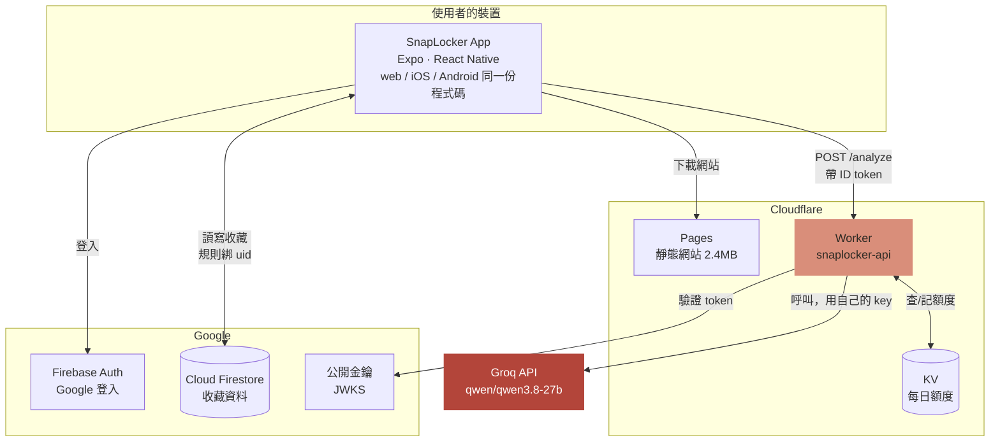
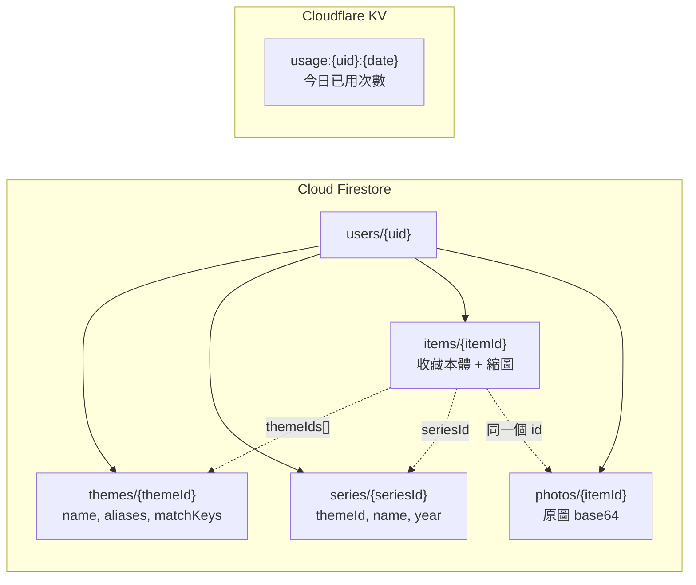
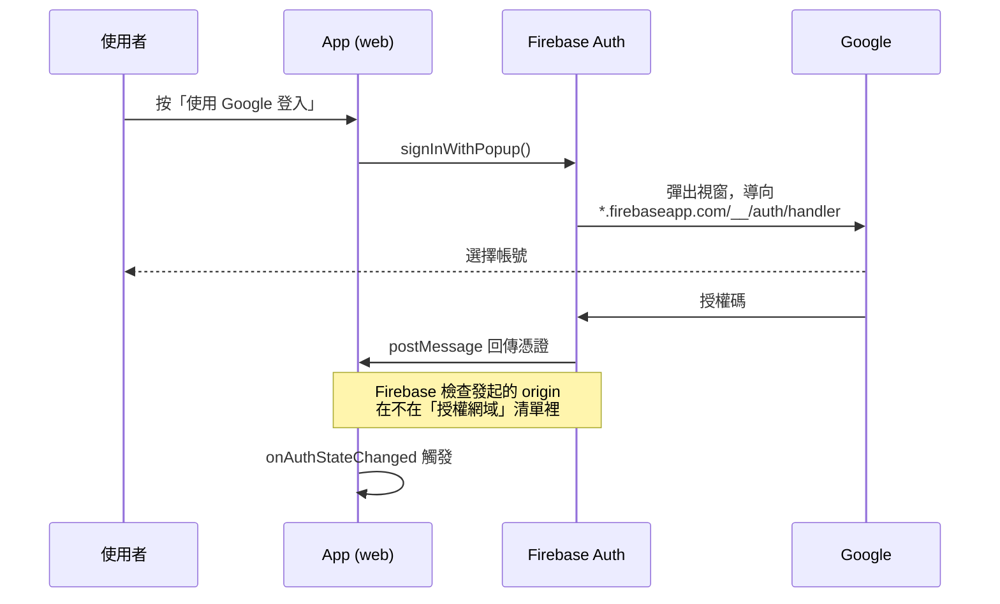
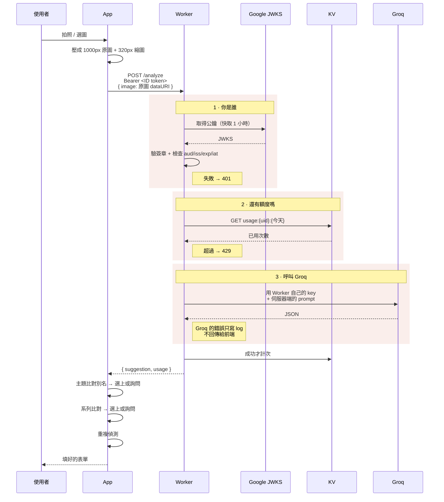
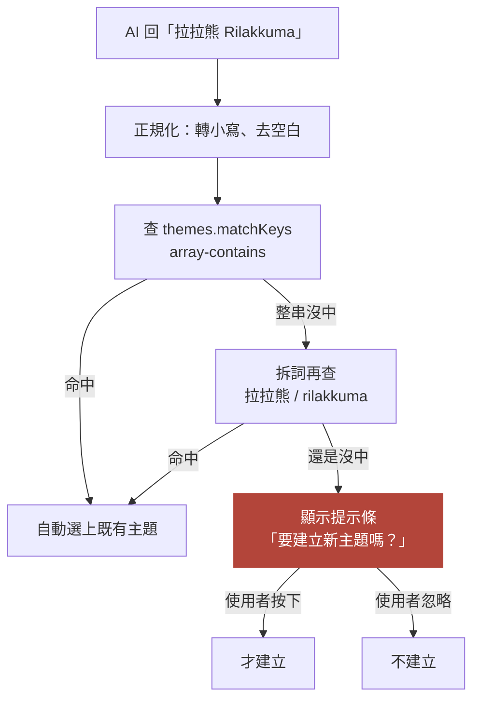
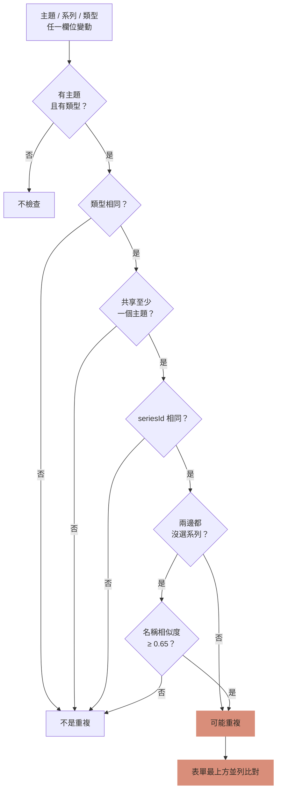
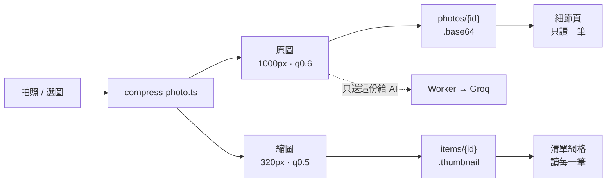
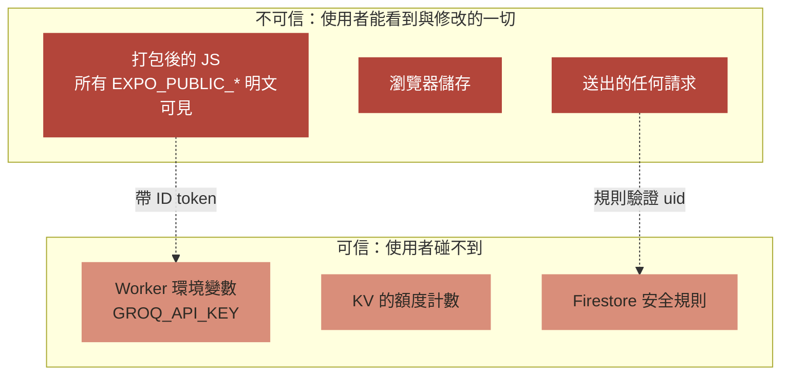

# 架構

SnapLocker 的完整結構、資料流與各個決定的理由。

- 分類模型與畫面規格 → [SPEC.md](SPEC.md)
- 環境設定與開發 → [README.md](README.md)
- 部署 → [DNS.md](DNS.md)
- 待辦 → [PLAN.md](PLAN.md)

## 目錄

1. [全貌](#1-全貌)
2. [三個執行環境](#2-三個執行環境)
3. [資料存在哪裡](#3-資料存在哪裡)
4. [登入流程](#4-登入流程)
5. [AI 辨識流程](#5-ai-辨識流程)
6. [重複偵測流程](#6-重複偵測流程)
7. [照片的兩段式儲存](#7-照片的兩段式儲存)
8. [平台差異](#8-平台差異)
9. [信任邊界](#9-信任邊界)
10. [模組地圖](#10-模組地圖)

---

## 1. 全貌



**最重要的一條線**：App **不會**直接呼叫 Groq。Groq 的 key 只存在 Worker 的環境變數裡。

原因見[第 9 節](#9-信任邊界) —— 簡單講，任何 `EXPO_PUBLIC_*` 都會明文躺在打包後的 JS 裡。

---

## 2. 三個執行環境

同一份 `src/` 產出三個目標，差異靠檔名慣例處理（`foo.web.ts` 在 web 上會蓋掉 `foo.ts`）。

| | Web | iOS | Android |
|---|---|---|---|
| 狀態 | ✅ 開發中主要平台 | ⚠️ 從未建置過 | ❌ 登入不能用 |
| 建置 | `expo export --platform web` | `eas build` 或 `expo run:ios` | 同左 |
| Google 登入 | `signInWithPopup`<br/>`use-google-sign-in.web.ts` | `expo-auth-session`<br/>`use-google-sign-in.ts` | 同 iOS，但缺 client ID |
| Auth 持久化 | 瀏覽器儲存 | AsyncStorage | AsyncStorage |
| 阻塞項 | — | 需要 Xcode 或付費 Apple 帳號 | `ANDROID_CLIENT_ID` 是空的 |

> Android 的 OAuth client ID 見 [PLAN.md](PLAN.md) §3.1，iOS 的測試路徑見 [PLAN.md](PLAN.md)。

---

## 3. 資料存在哪裡



### 為什麼收藏用 id 參照主題與系列

早期版本把主題名稱字串直接存在 item 上。問題是 AI 回「拉拉熊 Rilakkuma」，而使用者建的叫「拉拉熊」，就會產生第二筆近乎重複的主題，篩選列同時列出兩個。

改成 id 參照之後：**改名或新增別名只要改一個地方，所有收藏同步生效**。

### 四個集合的安全規則

```
match /users/{userId}/{collection}/{docId} {
  allow read, write: if request.auth != null
                     && request.auth.uid == userId
                     && collection in ['themes', 'series', 'items', 'photos'];
}
```

用白名單而非萬用比對 —— 之後不小心寫到別的路徑會被擋下，而不是默默放行。

---

## 4. 登入流程

Web 和原生走的是**兩條完全不同的路**。



### 為什麼 web 不用 expo-auth-session

`expo-auth-session` 在 web 上會把 redirect URI 指回**當下服務的 origin**。開發時是 `http://localhost:8081`，而 Firebase 自動建立的 OAuth client 沒有註冊這個位址，Google 會以 `400: redirect_uri_mismatch` 擋下。

更麻煩的是這表示**每換一個 port、每部署一個網域，都要回 Google Cloud Console 手動加一條**。

`signInWithPopup` 導向的是 Firebase 託管網域上的 handler，那個位址在建立 OAuth client 時就註冊好了。改由 **Firebase Console 的「授權網域」**控管，設定簡單得多。

> **代價**：每個新網域都要記得加進授權網域，否則 `auth/unauthorized-domain`。部署到 Cloudflare 時特別容易忘 —— Firebase 自己的網域預設就在清單裡，換別家就不是了。見 [DNS.md](DNS.md) 第 6 節。

---

## 5. AI 辨識流程



### 三個刻意的決定

**prompt 放在 Worker，不在前端。** 它決定模型被問什麼，那不該是呼叫端可以改寫的東西。Worker 直接 `import` 了 `src/constants/item-types.ts`（那個檔案沒有任何依賴），所以**類型清單只有一份**，前後端不會走鐘。

**Groq 的錯誤內容不回傳。** 它的 429 訊息會帶上你的組織 id 和 token 預算。那些只寫進 Worker 的 log，前端看到的一律是「AI 額度不足，請洽詢管理員」。

**成功才計次。** 模型回傳無法解析、或 Groq 掛掉，都不扣使用者的額度。

### 辨識後的比對

AI 回傳的主題名稱**不會直接寫入**。



**為什麼不自動建立**：模型看到任何有角色形狀的東西一定會給名字。測試時它把一隻隨手畫的粉紅兔子說成「Peppa Pig」（那是豬）。自動建立會讓這種幻覺直接長進主題清單。

**為什麼要拆詞**：Firestore 沒有不分大小寫的比對，也沒有子字串查詢。所以每個主題把它答應的所有拼法**預先正規化**存成 `matchKeys` 陣列。空白是直接去除而非壓縮，而且每個別名除了自己，還會把裡面的每個詞各自拆出來當一個 key —— 這樣 AI 回的合併形式才對得上使用者建的單一名稱。

---

## 6. 重複偵測流程

整個分類模型存在的理由。



### 前置條件為什麼存在

沒有主題或沒有類型就完全不檢查。資訊太少，而**每一筆沒填分類的收藏都跳警告的話，使用者很快就學會無視它** —— 那這個功能就廢了。

### 名稱相似度那道關卡

「系列相同」在兩邊都沒選系列時會退化成「兩個 `null` 相等」，於是任兩筆同主題同類型的收藏都會互相誤報。所以那種情況改由名稱決定。

演算法是**字元 bigram 的 Dice 係數**（`src/lib/similarity.ts`）。中文沒有空格可以斷詞，「拉拉熊繪畫系列行李箱」整串會被當成一個詞；滑動取兩字一組才抓得到共同片段。

門檻 0.65 是拿真實案例跑出分佈決定的，不是憑感覺：

| | 分數 |
|---|---|
| 應該命中，最低的 | **0.667**　同一個行李箱的「繪畫系列」vs「繪畫主題」 |
| **門檻** | **0.65** |
| 不該命中，最高的 | **0.600**　「行李箱」vs「旅行箱」、「馬克杯」vs「水壺」 |

### 刻意不比對的欄位

尺寸、顏色、標籤、數量。**它們恰恰是兩個候選最可能不同的欄位**，而「同系列不同尺寸」是不同的東西、不是重複。所以改成顯示在比對畫面上讓使用者判斷。

### 已知限制

這全部都是 metadata 比對，**抓不到「同一個東西但兩張照片不一樣」** —— 而那正是主要場景（店裡拍 vs 家裡拍，光線背景角度全不同）。影像比對因為要付費暫緩，見 [PLAN.md](PLAN.md) §1.1。

---

## 7. 照片的兩段式儲存



### 為什麼要拆

清單頁會讀取它顯示的**每一筆**。原圖留在 item 上的話，每次回到清單就會把整個收藏庫的照片重新下載一遍：

| 收藏數 | 原圖在 item 上 | 拆開後 |
|---|---|---|
| 20 件 | 約 4 MB | 約 400 KB |
| 100 件 | 約 20 MB | 約 2 MB |

### 實作細節

- `photos` 的文件 id **刻意與 item 相同**，取原圖不用查詢，直接讀一筆文件
- 寫入用 `writeBatch`，item 和照片不會脫鉤
- 刪除時**無條件刪兩邊** —— 刪不存在的文件在 Firestore 是 no-op，這樣就算 `hasPhoto` 旗標過期也不會留下孤兒圖
- 細節頁**漸進載入**：先畫縮圖，原圖抓到再換上，不讓整頁卡在一張圖上
- 送給 AI 的是**原圖**，縮圖太小看不清角色的臉

---

## 8. 平台差異

用 `foo.web.ts` 蓋掉 `foo.ts` 的慣例處理，共三處。

| 檔案 | Web | 原生 | 為什麼 |
|---|---|---|---|
| `lib/firebase` | `getAuth()` | `initializeAuth` + AsyncStorage | RN 沒有瀏覽器儲存；而 `getReactNativePersistence` 在瀏覽器版的 firebase 裡根本沒有匯出 |
| `hooks/use-google-sign-in` | `signInWithPopup` | `expo-auth-session` | 見[第 4 節](#4-登入流程) |

> **新增 `*.web.ts` 之後，Metro 不會自動重新解析模組。** 必須 `npx expo start --clear` 重啟，否則會繼續拿到舊的原生版本。徵兆是 bundle 大小完全沒變。

### 兩個 web 專屬的坑

**`Alert.alert()` 在 `react-native-web` 裡是空函式。**

```js
class Alert { static alert() {} }
```

所以 web 上所有錯誤訊息都不會出現，刪除確認框也不會跳 —— 刪除功能等於完全失效。現在全部改用 `components/inline-banner.tsx` 在畫面內呈現。**之後新增程式碼時不要用 `Alert`。**

**`expo-sqlite` 會讓整個 web bundle 編譯失敗**（`Worker chunk not found for: expo-sqlite/web/worker.ts`）。這個專案已經不用 SQLite 了（額度移到伺服器），但如果之後又引入，要記得它在 web 上編不過。

---

## 9. 信任邊界



### 什麼東西保護什麼

| 資產 | 靠什麼保護 | 夠嗎 |
|---|---|---|
| 收藏資料 | Firestore 規則綁 `request.auth.uid` | ✅ 別人讀不到你的東西 |
| Groq API key | 只存在 Worker 環境變數 | ✅ 從不送到瀏覽器 |
| 每日額度 | KV 計數，以驗證過的 uid 為 key | ✅ 前端改不到 |
| Worker 端點 | Firebase ID token + CORS 白名單 | ✅ 要先登入你的 App |
| Firebase web config | 不需要保護 | ✅ 設計上就是公開的 |

### 為什麼不能只做轉發

一個沒有驗證的 endpoint，只是把「別人偷你的 key」變成「別人直接用你的 endpoint」—— 額度照樣被吃光，而且更方便，連 F12 都不用開。

所以 Worker 做三件事，缺一不可：

1. **驗證 Firebase ID token** —— 不做的話，端點跟外洩的 key 一樣開放
2. **CORS 只回應白名單 origin** —— 用 `*` 的話，網路上任何頁面都能拿著在別處釣到的 token 來消耗額度
3. **額度記在伺服器** —— 以前記在 localStorage，使用者自己改得掉，等於沒有

### 額度重置的時區

伺服器用**固定時區（Asia/Taipei）**計算「今天」，不是裝置本地時間。以前依裝置午夜，改手機時鐘就能重置額度。

---

## 10. 模組地圖

```
src/
  app/                          expo-router 畫面
    _layout.tsx                 登入狀態分流 + navigation 主題
    +html.tsx                   web 的 HTML 外殼（標題、lang、底色）
    index.tsx                   清單 / 搜尋 / 篩選
    add.tsx                     拍照 → 辨識 → 重複偵測 → 建立
    item/[id].tsx               檢視 / 編輯 / 刪除
    themes.tsx                  主題管理（名稱、別名、系列）

  components/                   全部是展示層，不直接碰 Firestore
    app-header.tsx              品牌、主題管理入口、登出
    item-card.tsx               網格卡片
    duplicate-compare.tsx       重複比對並列檢視
    theme-selector.tsx          主題多選 + 可新建
    series-selector.tsx         系列單選，連動於所選主題
    type-picker.tsx             類型單選
    status-toggle.tsx           已擁有 / 想要
    chip.tsx / filter-row.tsx   篩選
    form-field.tsx / section.tsx
    inline-banner.tsx           取代在 web 無效的 Alert
    empty-state.tsx
    icon.tsx                    Feather 圖示的具名集合
    screen-container.tsx        套用 MaxContentWidth
    tag-editor.tsx / tag-chip.tsx
    themed-text.tsx / themed-view.tsx

  lib/                          所有 I/O 都在這裡
    firebase.ts / .web.ts       初始化（持久化方式不同）
    db.ts                       items / photos CRUD、重複偵測
    themes.ts                   themes CRUD、別名比對
    series.ts                   series CRUD
    similarity.ts               名稱相似度（bigram Dice）
    compress-photo.ts           產出原圖 + 縮圖
    groq.ts                     呼叫 Worker（不是 Groq）
    mock-data.ts                範例資料，僅開發模式

  constants/
    theme.ts                    配色、間距、字級
    item-types.ts               類型與狀態 slug ↔ 中文　※ Worker 也引用這個

  hooks/
    use-auth-user.ts            onAuthStateChanged 包裝
    use-google-sign-in.ts/.web  平台分流
    use-theme.ts

worker/                         Cloudflare Worker
  src/index.ts                  路由、CORS、Groq 呼叫、prompt
  src/firebase-auth.ts          手寫的 JWT 驗證（WebCrypto）
  src/usage.ts                  KV 的每日額度
  wrangler.toml                 設定（GROQ_API_KEY 刻意不在這裡）

public/
  _redirects                    Cloudflare Pages 路由，會被 expo export 複製

figma/                          設計原型，參考用，不執行
```

### 一條貫穿的原則

**畫面不直接碰 Firestore。** 所有 I/O 集中在 `lib/`，畫面只呼叫函式。所以像「照片拆成兩份存」這種改動只動了 `db.ts` 和 `compress-photo.ts`，六個畫面沒有一個需要知道細節。

### Worker 與 App 共用的東西

只有一個檔案：`src/constants/item-types.ts`。它沒有任何 import，所以 Worker 可以直接引用。這讓**類型清單只有一份** —— prompt 裡允許的值和 App 顯示的選項不可能不一致。
